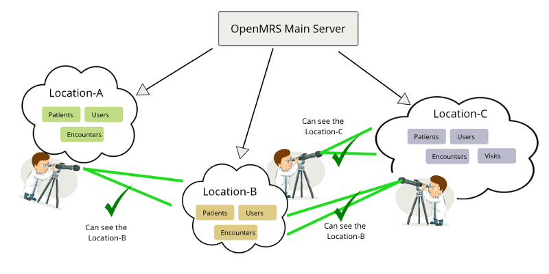
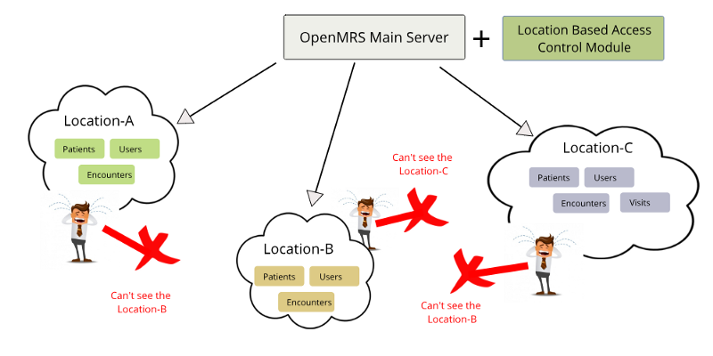

# What's LBAC module and why do I need it?

## What's Location Based Access Control module?

Although OpenMRS has a location functionality, i.e. it is possible to define multiple access locations for one server for the whole medical facility \(e.g. Registration Desk or Outpatient Clinic\) - there is no additional functionality assigned to it by default.

LBAC module makes use of location functionality in terms of assigning users and patients to certain locations. It means that if a user logs into a location, he should see only the patients, encounters, visits etc. assigned to the login location only.


While LBAC module introduces more separation and access control between the locations, admins and developers are still able to see the data coming from all locations.


By default, OpenMRS allows the users to see information about the patients registered in other locations, which might be a problem in some situations \(let's say, a paramedic from Emergency Department doesn't expect to be able to see patients coming from Laboratory\).

This image shows what's the situation like when LBAC module is not used:

## What are the benefits of using this module amongst larger distributions?

The separation between independent units, especially amongst larger facilities \(like huge hospitals\) is important. One of the main goals of EMRs is to provide quick access to the information about patients, and a situation where a doctor has to search and scroll through a huge list of patients available in the whole system, coming from the whole medical facility is not desired.

LBAC module introduces the possibility to assign users and patients to specific locations, enabling data access only to the information assigned to certain location.

This image, in comparison to the image above, describes how LBAC module works:

