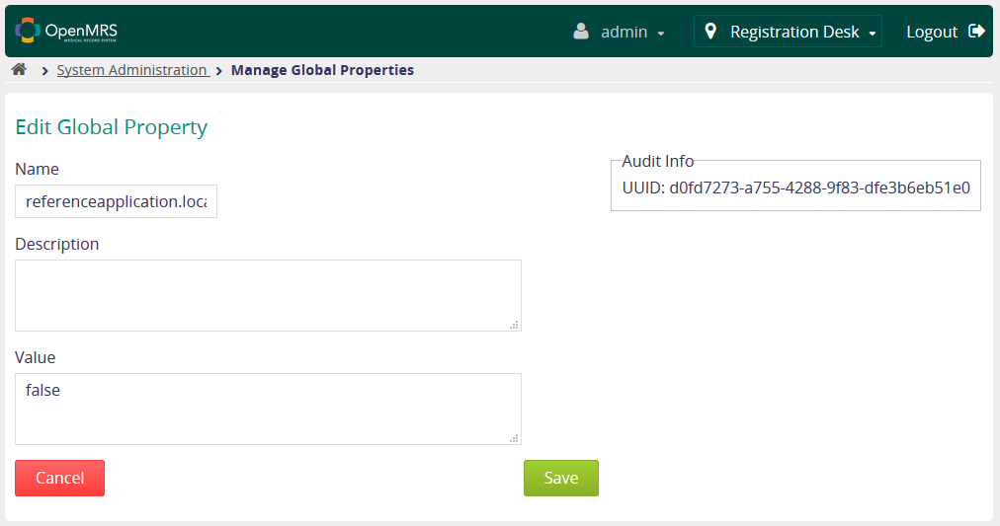

# Additional config of LBAC module

## Do I have to do anything more?

If your OpenMRS instance has any of the optional modules, you need to check out additional configuration steps below.

## Additional configuration steps

### Admin UI module - v1.2.4 or later

This version of Admin UI module lets you assign users \(like clerks, doctors or nurses\) to a single location - this will allow them to see patients, encounters etc. only from the location they're assigned to.


By default, LBAC filters out the database's contents by **session location**, i.e. the location user has selected when logging into the system. This functionality \(to assign a user to just one location\) is optional.


**To assign a location to a user:**

Now you have to find the user you want to have a location assigned to. Click on the "edit" button next to the user's name.

Now you have to repeat this process for every user you want assign a location to.


Since now, a user with assigned location will be able to only see the encounters, patients etc. only from the assigned location.


### Reference Application module - v2.9.0 or later

If you're using appropriate version of Reference Application module, you might've noticed that the location selector is gone and the page looks like this:

It has happened because LBAC module allows to automatically login the user to assigned location \(which you could set using the steps above\). If a user without assigned location tries to log into the system, he'll be display a login page once again, with location selector which will look like this:

You can **disable** this default behavior \(and bring back the location selector\) **following this steps:**

Now, you have to find `referenceapplication.locationUserPropertyName` property on the list. Now click "edit" button on the right of the property name, and set the Value to "false". This is how it should look like:


Click "Save" and we're ready with configuration process! Now you can start using the module.


