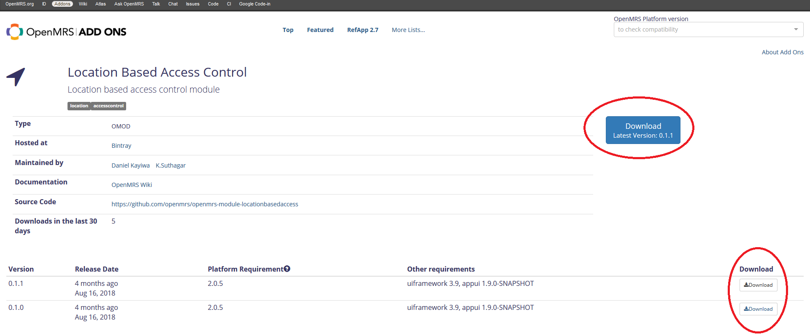

# Installing the module

Although the process of installing modules is described in the [OpenMRS Guide - Customizing OpenMRS with Plug-in Modules](http://guide.openmrs.org/en/Configuration/customizing-openmrs-with-plug-in-modules.html), the **steps, specifically for LBAC module are described below:**

### **1. Download the LBAC module from OpenMRS Addons site**

You can find the download page for the LBAC module [here, on om.rs/addons](https://addons.openmrs.org/show/org.openmrs.module.locationbasedaccess). To download the latest version, hit "Download" on the top or select any of the available versions on the list below.

### 2. Copy the downloaded \*.omod file to modules directory

Now, after downloading the module in \*.omod format, you have to copy it to the modules directory. The path to the folder is: `<openmrs folder>/modules` where `<openmrs folder>` is the main directory of your OpenMRS installation.

### 3. Restart OpenMRS

The last step is to restart OpenMRS, because modules are loaded on the startup. It doesn't matter how you do it, so go with your usual way.


Congratulations! You've installed the module and if you do not have any of the optional modules installed - you're ready to go! :\)



If your OpenMRS instance has any of the optional modules, go to the next page.



If you're using Reference Application module - v2.9.0 or above you might've noticed that the location selector is gone - it was intended and it is described on the next page.


