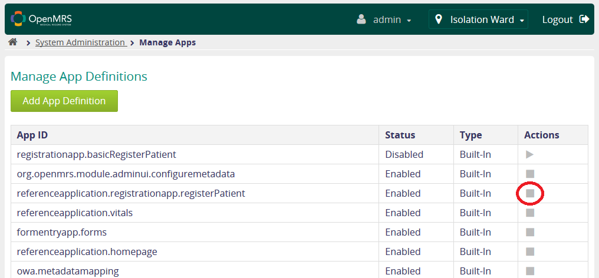

# Requirements and preparation

## Required modules

Before we get started with the installation of the module, you need to ensure that your instance of OpenMRS uses appropriate version of the core and contains all required modules by LBAC - if you forget to install/update required ones, the installation might fail or the system could behave unexpectedly.

**To use Location Based Access Control \(as of v0.11\) you need:**

* OpenMRS Core - v2.0.5 or later
* [App UI module](https://addons.openmrs.org/show/org.openmrs.module.appui) - v1.9 or later
* [UI Framework module](https://addons.openmrs.org/show/org.openmrs.module.uiframework) - v3.9 or later

**Optional modules**, required to use extended functionality of LBAC module are:

* [Admin UI Module](https://addons.openmrs.org/show/org.openmrs.module.admin-ui-module) - v1.2.4 or later \(assign system users to locations\)
* [Reference Application Module](https://addons.openmrs.org/show/org.openmrs.module.reference-application-module) - v2.9 or later \(automatically login users into desired location\)


Module installation and update process is thoroughly descripted in OpenMRS User Guide - [Customizing OpenMRS with Plug-In Modules](http://guide.openmrs.org/en/Configuration/customizing-openmrs-with-plug-in-modules.html).



If your instance of OpenMRS misses any of the modules listed above, you can click on the lists' items - you'll be redirected to [om.rs/addons](https://om.rs/addons) - cumulative source of all modules available for OpenMRS.



If you meet all the requirements listed above, we can start with preparing the system! :\)


## Preparation

Before installing LBAC module we also have to change some settings in the system.

### 1. Create person attribute to store information about user's/patient's location

To be able to assign a location to an user or a patient, we need to introduce a new person attribute type which will store the ID of assigned location.

**Follow these steps:**


  
Now, we have to enter the name and select the format of our attribute we're about to create.  
There's no name requirement, but we suggest using: `LocationAttribute`

As the format, please select: `java.lang.String`


Now, we can hit **Save Person Atrribute Type.**

If the operation succeeded \(notice the pop-up on the screenshot below\), we should be on the Manage Person Attribute Types page now. Click on the freshly created attribute's name:


Every new Person Attribute Type we add to the system is getting a UUID \(universally unique identifier\) assigned to it - the property we've added will be referenced later using its UUID and we need to save it somewhere for the further steps \(you might e.g. open the notepad and save the identificator in a text file\).



Great! We've created the new attribute which will store the location's ID assigned to a person - we'll need the UUID you just saved for further steps.



Note that UUIDs are generated randomly, so yours will be obviously different from the one you see on the screenshots.


### **2. Create Global Property with Person Attribute Type information**

Now, our aim is to "tell" the LBAC module in which Person Attribute the information about location is saved. To do so, we're going to create a Global Property, which will navigate LBAC module to appropriate Person Attribute. Go back to the home page \(hit "Home" on the top of the screen\) and **follow these steps:**


Now, in Name field enter \(the name **must** be like that\): `locationbasedaccess.locationAttributeUuid`and copy the UUID you've saved before to Value field.



Hit save and we're good to go further :\)


### **3**. Configure Patient Registration App with Location Fragment

One of the main features of LBAC module is to assign a patient to a specific location. To be able to that, we need to modify the Patient Registration App to add a location selection drop-down.

Go back to the home page and **follow these steps:**


**Now you have to decide** how you do want to setup the new Patient Registration App:

* If you're not familiar with custom apps and you're using the default registration app bundled with your OpenMRS Reference Application instance, use **Option A** below.
* If you're already using a custom registration app and you're familiar with setting them up, use **Option B**.



Before adding a new Patient Registration App, disable the one you're currently using. To do it, click on the "stop" button next to App ID: `referenceapplication.registrationapp.registerPatient`



  
Now we're ready to add the new Registration App. **Steps below:**


A page containing two fields will be displayed. In App ID field, please enter \(the name **must** be exactly like this\): `referenceapplication.registrationapp.myRegWithLoc`

Next, go to Appendix A of this guide and copy the app definition to Definition field.



The last step is to modify a single line in the snippet you've just copied. Search for `"uuid": "<location attrib uuid>"` line around the bottom of the snippet you've entered, and replace `<location attrib uuid>` with UUID of our new attribute, which we obtained before.



If you have already created a custom app before, you already know the steps. To add the location selection drop-down to your currently used registration app, add the snippet below to `"sections"` tag of app definition:

```text
{
    "id": "accesslocation-info",
    "label": "Access Location",
    "questions": [
        {
            "legend": "Patient Location ",
            "id": "patientLocationLabel",
            "fields": [
                {
                    "type": "personAttribute",
                    "label": "Select Location",
                    "formFieldName": "locationId",
                    "uuid": "<location attrib uuid>",
                    "widget": {
                        "providerName": "locationbasedaccess",
                        "fragmentId": "field/locations"
                    }
                }
            ]
        }
    ]
}
```

Besides that, you also have to replace `<location attrib uuid>` with the attribute UUID you've obtained before.




Hit "Save" and we're ready to install the module! You can go to the next page.


