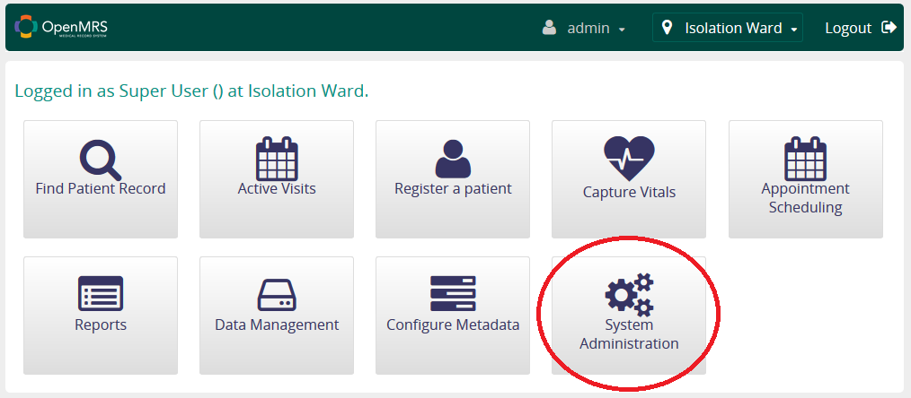
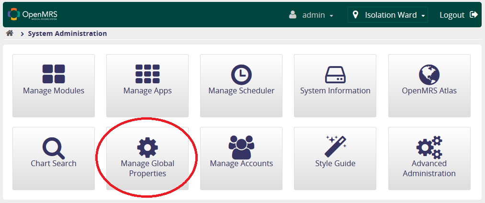

# Using module's features

Although LBAC module infact modifies the behavior of some parts of the system rather than introducing new functionality, there's some new functions we've covered here:

### Change the location of already registered patient

If you want to move a patient to another location, please open the summary page of the patient you want to move and follow these steps:


Congrats! You've changed the location assigned to a patient.


### Show/hide location selector on the login page \(optional functionality\)

You can **show/hide the location selector** **following these steps:**

Now, you have to find `referenceapplication.locationUserPropertyName` property on the list. Now click "edit" button on the right of the property name, and to:

* enable the location selector, set the Value to `false`
* disable the location selector, set the Value to `locationUuid`


Click "Save" and that's everything!


